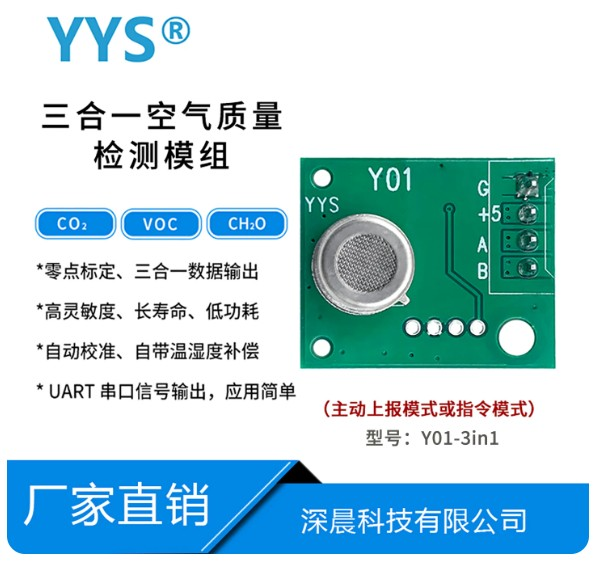
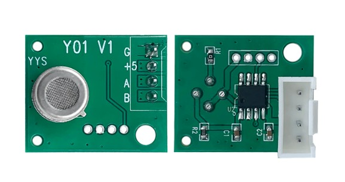

**语言 / Language:** [English](README.md) | [中文](README.zh-CN.md)

# 深晨 Y01-3in1 · 三合一气体传感器模组驱动

**厂商：** 深圳市深晨科技有限公司（Shenzhen Shenchen Technology Co., LTD）  
**型号：** Y01-3in1  
**类型：** TVOC + CH₂O + CO₂ 三合一，UART 主动上传  

面向深晨 **Y01-3in1** 三合一空气质量模组的平台无关 C 驱动。



*Y01-3in1 三合一空气质量检测模组（TVOC / CH₂O / CO₂）· 深晨科技*



*Y01 模组 PCB 正反面*

---

## 特性

- 平台无关：`sensor_io_t` 注入 `read` / `now_ms`
- 主动上传模组：调用 `get()` 即可，无需下发命令
- 输出：`tvoc_mg_m3`、`ch2o_mg_m3`、`co2_ppm`（均为 `float`）
- 预热 5 分钟：**解析成功后**才返回 `Y01_ERR_WARMUP`
- 返回值：`0` 成功 / `1` 无帧或参数错 / `2` 预热中

## 需要实现的 IO 接口

驱动不碰 HAL，只依赖你在 `init` 时注入的函数指针（见 `src/sensor.h`）：

```c
typedef struct sensor_io {
    /* 读串口：非阻塞，返回本次真正读到的字节数；0 = 暂无数据 */
    uint32_t (*read)(uint8_t *buf, uint32_t len);

    /* 写串口：本模组主动上传，驱动不发命令，可填 NULL */
    uint32_t (*write)(const uint8_t *buf, uint32_t len);

    /* 毫秒时钟：必填；用于超时与预热计时 */
    uint32_t (*now_ms)(void);
} sensor_io_t;
```

约定：

1. **`read` / `write` 必须非阻塞**——内部禁止 `delay` / 等发送完成；没数据返回 0，由驱动重试到 `wait_ms` 截止。
2. **`now_ms` 返回开机毫秒数**（允许回绕），预热与总预算都基于它。
3. 多传感器共用 UART 时，**切通道后清 RX 缓冲是调用方的职责**。

驱动保持平台无关：`init` 注入 `io` 即可，不绑定具体 MCU 或 RTOS。

> 注意：说明书里的问答命令会关掉自报，需断电才能恢复——本驱动不会发送。

## 用法

```c
#include "sensor_y01_3in1.h"

sensor_y01_t ctx;
sensor_y01_data_t data = {0};

sensor_y01_init(&ctx, &io);

uint32_t err = sensor_y01_get(&ctx, &data, Y01_WAIT_MS_TYPICAL);
if (err == Y01_OK) {
    /* data.tvoc_mg_m3 / ch2o_mg_m3 / co2_ppm */
} else if (err == Y01_ERR_WARMUP) {
    /* 链路正常，仍在 5 分钟预热内 */
} else {
    /* 超时 / 校验失败 / 参数错误 */
}
```

编译：把 `src/*.c` 加入工程，`src/` 加入 include 路径。

## 文件结构

| 路径 | 说明 |
|------|------|
| `src/sensor.h` | 依赖注入（IO 接口） |
| `src/sensor_y01_3in1.h/.c` | 本模组驱动 |
| `img/` | 产品图 |
| `docs/三合一气体传感器模组_Y01-3in1.pdf` | 厂家用户手册 |

---

**License:** MIT  
**规格书:** 见 `docs/`
